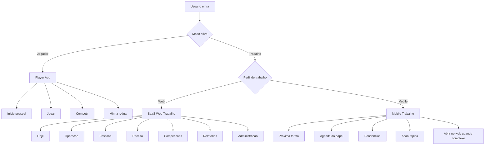

# Work SaaS V5 Complete Mapping Manual - 2026-05-22

Status: manual de produto e arquitetura para repensar a area Trabalho como SaaS profissional antes de novas implementacoes.

Regra principal: este documento nao e uma justificativa para preservar a organizacao atual. A organizacao atual serve apenas como inventario de funcoes existentes. A arquitetura alvo deve nascer das entidades, personas, frequencia de uso, permissoes e boas praticas de SaaS.

## 1. Escopo Desta Rodada

Esta rodada cria uma base executavel para decidir e implementar a nova area Trabalho.

Foi analisado:

- rotas em `src/App.tsx`;
- shell global em `src/components/AppShell.tsx`;
- navegacao em `src/components/BottomNav.tsx`;
- permissoes e produtos em `src/lib/place-management.ts`;
- rotas internas de local em `src/lib/place-admin-navigation.ts`;
- central de trabalho em `src/pages/ManagementHubPage.tsx`;
- local/admin em `src/pages/PlacesPage.tsx`;
- modulos de reservas, aulas, pessoas, receita, POS, equipe e ajustes em `src/components/place/*`;
- competicoes em `src/pages/EventsHubPage.tsx`, `TournamentPage.tsx` e `LeagueDetailsPage.tsx`;
- migrations e RPCs em `supabase/migrations/*`;
- docs historicos pre-V5, auditorias reais e relatorios de fluxo.

Tambem foram usadas referencias de SaaS para padroes, nao para copiar UI:

- Shopify Admin: https://help.shopify.com/en/manual/shopify-admin
- Stripe Dashboard: https://docs.stripe.com/dashboard/basics
- Jira / Atlassian navigation: https://support.atlassian.com/jira-software-cloud/docs/what-is-the-new-navigation/
- Square Dashboard: https://squareup.com/help/us/en/article/5392-square-dashboard
- CourtReserve: https://courtreserve.com/
- Mindbody business: https://www.mindbodyonline.com/business/fitness
- Zen Planner: https://zenplanner.com/product/

## 2. Diagnostico Honesto

O ATP ja tem muitas funcoes de SaaS:

- lugares/unidades;
- quadras;
- reservas;
- lista de espera;
- bloqueios;
- aulas;
- turmas;
- professores;
- alunos;
- reposicoes;
- mensalidades;
- pagamentos stub;
- CRM/leads;
- socios;
- planos;
- caixa/POS;
- estoque;
- despesas;
- equipe;
- permissoes;
- torneios;
- ligas;
- inscricoes;
- pagamentos de competicao;
- staff de competicao;
- resultados;
- chat/comunicacao;
- calendario;
- links publicos;
- convites;
- relatorios iniciais.

O problema nao e falta de funcao. O problema e que a interface ainda pensa em "modulos que existem" e nao em "trabalhos que precisam ser feitos".

Sintomas encontrados:

- a mesma funcao aparece como menu, subaba e card;
- calendario aparece em varios dominios sem uma definicao mental unica;
- reservas, aulas e calendario se sobrepoem;
- alunos, clientes, socios, leads e staff nao tem um modelo mental unico de pessoa;
- receita aparece em finance, aulas, reservas, socios e pagamentos pessoais;
- mobile Trabalho carrega paginas profundas do web em vez de operacao curta;
- competicoes usam rotas publicas mesmo quando o usuario esta organizando;
- setup raro ainda aparece perto da rotina em algumas areas;
- relatorios e operacao disputam espaco;
- multiunidade existe, mas o contexto de organizacao/unidade ainda nao e forte o suficiente;
- o menu externo e os menus internos as vezes competem.

## 3. Principios SaaS Extraidos Das Referencias

Padroes recorrentes em SaaS maduros:

1. O menu principal organiza dominios persistentes, nao cada acao.
2. A tela inicial mostra filas, alertas e proximas tarefas, nao uma arvore de funcionalidades.
3. Objetos importantes tem detalhe proprio: cliente, reserva, aula, turma, pagamento, torneio, liga.
4. Configuracoes ficam separadas da operacao diaria.
5. Relatorios ficam separados da execucao.
6. Permissoes filtram navegacao e tambem acoes internas.
7. Listas densas usam tabelas/saved views/filtros; mobile usa cards e sheets.
8. Topbar carrega contexto global: conta, organizacao/unidade, busca, notificacoes, modo.
9. Mobile nao replica o dashboard completo; mobile resolve tarefas em movimento.
10. Acoes contextuais aparecem junto do objeto certo, nao como item solto no menu.
11. Fluxo e mais importante que label: toda acao precisa levar ao proximo passo natural.
12. O usuario nao deve escolher entre dois menus parecidos para fazer a mesma coisa.

## 4. Modelo Alvo Em Tres Camadas

```text
ATP
  Player App
    Jogar
    Competir
    Minha rotina
    Perfil

  SaaS Web Trabalho
    Organizacao
    Unidade
    Operacao
    Pessoas
    Receita
    Competicoes
    Relatorios
    Administracao

  Mobile Trabalho
    Hoje
    Agenda do papel
    Pendencias
    Acoes rapidas
    Comunicacao
    Handoff para web
```

Decisao importante:

- `Competir` no Player App e participacao/descoberta.
- `Competicoes` no Trabalho e organizacao/operacao.
- `Calendario` no Trabalho e mapa de tempo operacional.
- `Minha rotina` no Player App e agenda pessoal.

## 5. Entidades Do Produto

### 5.1 Organizacao E Unidade

```text
Organizacao
  Unidade/Local
    Quadras
    Regras
    Equipe
    Professores
    Agenda operacional
    Reservas
    Aulas
    Pessoas
    Receita
    POS
    Relatorios
```

### 5.2 Pessoas

Pessoa deve virar o modelo mental principal, mesmo que o backend ainda use tabelas separadas.

Uma pessoa pode ter relacoes:

- lead;
- cliente;
- aluno;
- socio;
- jogador;
- responsavel;
- professor;
- staff;
- pagador;
- participante de torneio/liga.

### 5.3 Tempo

Tudo que ocupa tempo deve poder aparecer no calendario operacional:

- reserva;
- bloqueio;
- aula;
- turma recorrente;
- reposicao;
- evento/torneio;
- manutencao;
- disponibilidade de professor;
- ocupacao de quadra.

### 5.4 Receita

Receita do local inclui:

- recebiveis;
- pagos;
- despesas;
- planos;
- pacotes;
- mensalidades;
- reservas;
- aulas;
- inscricoes;
- POS;
- futuro: recorrencia, split, comissao, nota, conciliacao.

Pagamentos pessoais do jogador nao pertencem a Receita do local. Eles aparecem no Player App.

### 5.5 Competicoes

Competition OS inclui:

- torneios;
- ligas;
- inscricoes;
- pagamentos;
- participantes;
- jogos;
- resultados;
- staff;
- publicacao;
- comunicacao;
- relatorios finais.

## 6. Personas E Missoes

| Persona | Missao primaria | Frequencia | Superficie principal |
| --- | --- | --- | --- |
| Jogador puro | reservar, jogar, competir, ver agenda pessoal | diaria/eventual | Player App |
| Aluno | ver aula, professor, turma, pagamento e reposicao | semanal | Player App + mobile pessoal |
| Socio/mensalista | reservar com regra/plano e acompanhar pagamento | semanal | Player App |
| Jogador competitivo | ver jogo, adversario, chat, resultado e classificacao | evento/semanal | Player App + Competition participant |
| Professor | ver aulas do dia, alunos, turma, quadra, reposicoes e progresso | diaria | Mobile Trabalho + SaaS web limitado |
| Recepcao | criar/editar/cancelar reserva, atender pessoa, reagendar, WhatsApp | diaria | SaaS web + Mobile Trabalho |
| Financeiro | cobrar, marcar pago, ver vencidos, despesas e resumo | diaria/semanal | SaaS web + mobile financeiro |
| Caixa | vender rapido, ver vendas do dia, estoque baixo | diaria | Mobile Trabalho + SaaS web POS |
| Gestor de unidade | resolver bloqueios e administrar unidade | diaria/semanal | SaaS web |
| Dono multiunidade | comparar unidades, resolver excecoes, ver relatorios | diaria/semanal | SaaS web |
| Organizador | criar e operar torneio/liga por fase | evento | SaaS web + mobile evento |
| Scorekeeper | lancar resultados | evento | Mobile Trabalho + Competition OS |
| Check-in | validar inscritos e credenciar participantes | evento | Mobile Trabalho + Competition OS |
| Media/comunicacao | publicar avisos, links e resultados | evento | Mobile Trabalho + Competition OS |

## 7. Matriz De Entrada Por Persona

| Persona | Ao abrir Trabalho deve ver | CTA primario | Nunca deve dominar |
| --- | --- | --- | --- |
| Professor | proxima aula e agenda do dia | abrir aula | financeiro, POS, ajustes |
| Recepcao | reservas do dia e atendimento rapido | nova reserva | configuracao de quadra/regras |
| Financeiro | vencidos e recebiveis de hoje | cobrar / marcar pago | aulas e POS como foco |
| Caixa | venda rapida | vender | resumo financeiro amplo |
| Gestor | pendencias criticas por dominio/unidade | resolver maior bloqueio | lista infinita de modulos |
| Organizador | competicoes com bloqueio por fase | resolver bloqueio | descoberta publica |
| Multiunidade | ranking de unidades por urgencia | abrir unidade critica | cards repetidos sem contexto |

## 8. Arquitetura SaaS Web Alvo

### 8.1 Topbar

Deve conter:

- marca ATP;
- seletor Jogador/Trabalho;
- usuario;
- organizacao ativa;
- unidade ativa, quando houver;
- notificacoes;
- busca global futura;
- breadcrumb contextual.

### 8.2 Sidebar Web Por Dominio

```text
Trabalho
  Hoje

Operacao
  Calendario
  Reservas
  Aulas
  Loja/POS

Pessoas
  Pessoas
  Leads
  Clientes
  Alunos
  Staff

Receita
  Receber
  Pagos
  Despesas
  Planos e pacotes
  Resumo

Competicoes
  Torneios
  Ligas
  Publicacao

Relatorios
  Operacao
  Receita
  Pessoas
  Competicoes

Administracao
  Equipe
  Recursos
  Regras
  Permissoes
  Dados publicos
  Avancado
```

Regra: a sidebar web pode ter profundidade, mas nao deve listar tudo sempre. Ela mostra somente dominios permitidos e relevantes para o papel/unidade.

### 8.3 Estrutura De Pagina SaaS

Toda pagina web Trabalho deve seguir:

```text
Contexto global
  Breadcrumb
  Titulo do dominio
  Pergunta principal
  CTA dominante
  KPIs acionaveis
  Lista/tabela ou calendario
  Drawer/detalhe
  Estados vazios
  Historico/relatorio em camada secundaria
```

## 9. Mobile Trabalho Alvo

Mobile Trabalho nao e mini SaaS web.

Ele deve ter:

- header compacto;
- papel ativo;
- unidade/competicao ativa;
- uma pergunta: "o que preciso resolver agora?";
- 3 a 5 cards acionaveis;
- bottom nav por papel;
- sheets para detalhe;
- link "abrir no web" para acao complexa.

Navegacao alvo:

| Papel | Bottom nav mobile |
| --- | --- |
| Professor | Hoje, Agenda, Turmas, Alunos, Perfil |
| Recepcao | Hoje, Reservas, Pessoas, Aulas, Mais |
| Financeiro | Receber, Pagos, Despesas, Resumo, Perfil |
| Caixa | Vender, Hoje, Estoque, Produtos, Perfil |
| Organizador | Hoje, Torneios, Ligas, Avisos, Perfil |
| Gestor | Hoje, Calendario, Aulas, Receita, Mais |

## 10. Fluxograma Macro



## 11. Regras De Posicionamento

### 11.1 Uma funcao vai para menu principal se:

- for destino frequente;
- representar dominio;
- tiver varias listas/objetos;
- for previsivel para muitas personas;
- nao for apenas acao de um item.

### 11.2 Uma funcao vira CTA se:

- inicia um fluxo;
- depende do contexto atual;
- pode ser concluida em poucos passos;
- nao merece uma pagina so para existir.

### 11.3 Uma funcao vai para detalhe/drawer se:

- pertence a um objeto especifico;
- edita um registro;
- envolve historico;
- precisa manter contexto da lista.

### 11.4 Uma funcao vai para configuracao se:

- e rara;
- muda regra estrutural;
- afeta varios fluxos;
- exige permissao alta;
- pode quebrar operacao se mal usada.

### 11.5 Uma funcao vai para relatorio se:

- responde "como estamos?";
- nao executa tarefa imediata;
- analisa periodo;
- precisa exportar, comparar ou auditar.

## 12. Decisoes Produto V5

1. Calendario e modulo de Operacao, nao subaba de Reservas.
2. Reservas e ciclo de vida de reserva: criar, editar, cancelar, reagendar, pagar, WhatsApp.
3. Aulas e operacao de turmas/alunos, nao ERP de professores.
4. Chamada de aula e opcional por configuracao, desligada por padrao.
5. Professores pertencem a Pessoas/Equipe, com relacao com Aulas.
6. Pessoas e dominio unico para leads, clientes, alunos, socios, staff e responsaveis.
7. Receita centraliza dinheiro do local.
8. Pagamentos pessoais ficam no Player App.
9. POS e venda/estoque, nao financeiro amplo.
10. Competicoes no Trabalho sao operacao por fase.
11. Player App nunca deve vazar ferramenta administrativa.
12. Mobile Trabalho e tarefa rapida, nao web encolhido.

## 13. Documentos V5 Complementares

Este manual deve ser lido junto com:

- `WORK_SAAS_V5_FUNCTION_INVENTORY_MATRIX_2026_05_22.md`
- `WORK_SAAS_V5_SCREEN_AND_FLOW_CONTRACTS_2026_05_22.md`
- `WORK_SAAS_V5_PAGE_BLUEPRINTS_2026_05_22.md`
- `WORK_SAAS_V5_PERSONA_JOURNEY_MAPS_2026_05_22.md`
- `WORK_SAAS_V5_OBJECT_STATE_MODEL_2026_05_22.md`
- `WORK_SAAS_V5_NAVIGATION_SITEMAP_SPEC_2026_05_22.md`
- `WORK_SAAS_V5_ACCEPTANCE_QA_MATRIX_2026_05_22.md`
- `WORK_SAAS_V5_IMPLEMENTATION_QUEUE_2026_05_22.md`

## 14. Criterio De Pronto Para Implementar

So iniciar implementacao quando:

1. cada funcao atual tiver destino;
2. cada persona tiver fluxo principal;
3. cada tela tiver contrato;
4. web e mobile estiverem separados;
5. rotas antigas estiverem preservadas;
6. permissoes estiverem preservadas;
7. toda configuracao rara estiver fora da rotina;
8. todo relatorio estiver fora da execucao diaria;
9. toda acao principal tiver proximo passo;
10. houver queue V5 por sprint com aceite e rollback.
