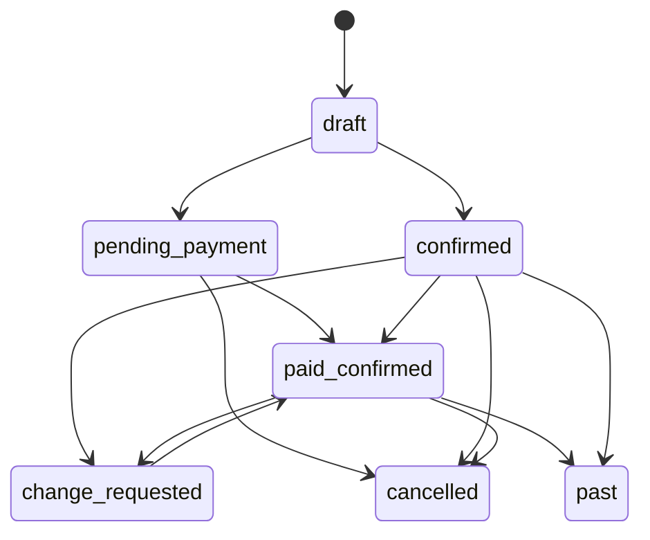
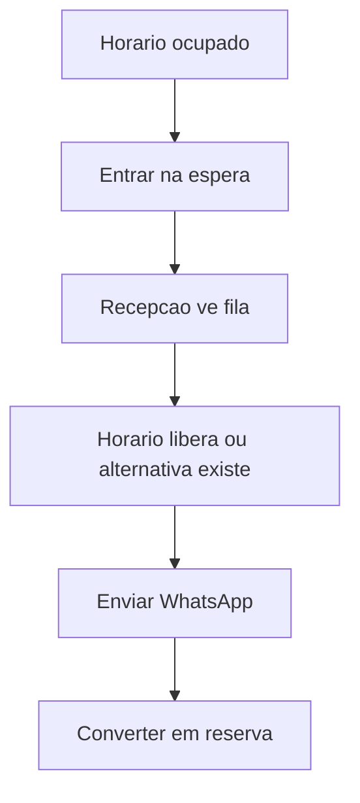
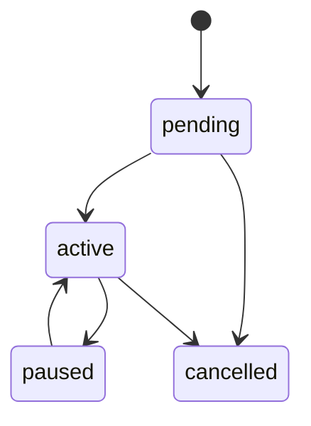
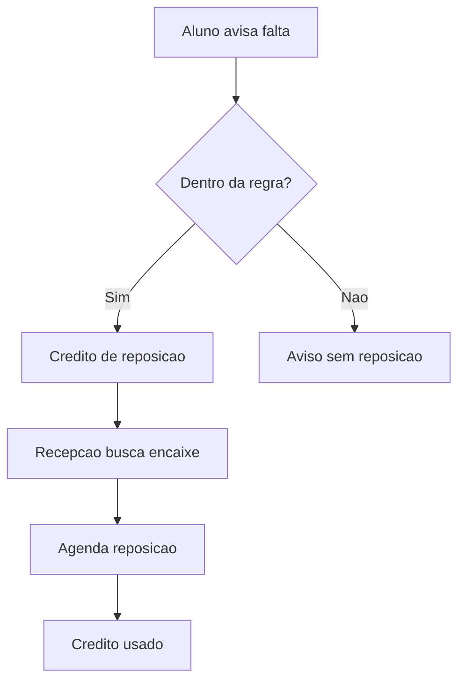
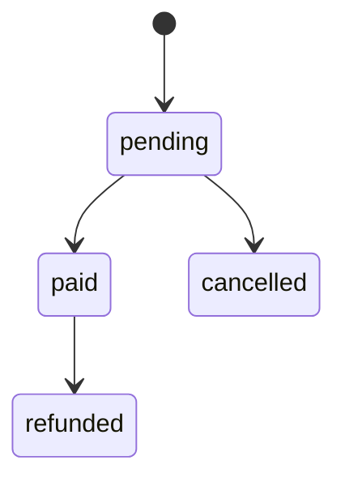
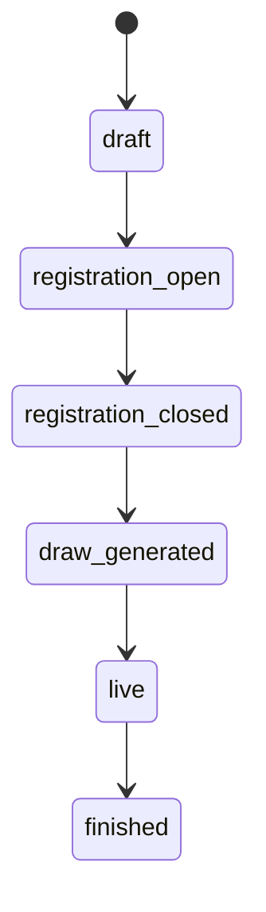

# Work SaaS V5 Object State Model - 2026-05-22

Status: modelo de objetos, estados e transicoes para orientar telas e fluxos.

Regra: se uma tela mexe em um objeto, ela deve respeitar o ciclo de vida abaixo.

## 1. Organization / Place

### Objeto

```text
Organization
  id
  name
  owner
  units[]
  plan
  settings

Place / Unit
  id
  organization_id
  name
  city/state
  product_plan
  public_profile
  resources
  staff
```

### Estados Operacionais

| Estado | Definicao | Primeira acao |
| --- | --- | --- |
| setup_incomplete | falta quadra/regra/equipe basica | completar setup |
| operational | pode receber reservas/aulas | abrir Hoje |
| attention | pendencias criticas | resolver bloqueio |
| suspended/future | plano ou acesso bloqueado | resolver assinatura/acesso |

## 2. Court / Resource

### Objeto

```text
Court
  id
  place_id
  name
  surface
  price
  member_price
  active
```

### Destino

- Config > Recursos para CRUD.
- Calendario para ocupacao.
- Reserva para selecionar.

### Estados

- ativa;
- inativa;
- bloqueada em horario;
- ocupada por reserva;
- ocupada por aula;
- ocupada por competicao.

## 3. Booking / Reservation

### Objeto

```text
Booking
  id
  place_id
  court_id
  user_id/client
  starts_at
  ends_at
  status
  payment_status
  notes
  series_id?
```

### Estados

| Estado | Significado | Acoes permitidas |
| --- | --- | --- |
| draft/local | ainda no wizard | confirmar ou abandonar |
| pending_payment | criada, aguardando pagamento | pagar, cancelar |
| confirmed | reservada | editar admin, cancelar, WhatsApp |
| paid_confirmed | paga e confirmada | reagendar, cancelar conforme regra |
| cancelled | cancelada | historico |
| past | ja ocorreu | historico |
| change_requested | cliente recebeu link de troca | confirmar novo horario ou expirar |

### Transicoes



### Regras UX

- horario ocupado nao mostra "Criar reserva";
- lista de espera e alternativa aparecem quando nao ha vaga;
- WhatsApp e comunicacao, nao etapa obrigatoria de confirmacao;
- admin/secretaria/gerente podem editar manualmente;
- jogador altera via link seguro e agenda disponivel.

## 4. Waitlist

### Estados

- waiting;
- invited;
- converted;
- cancelled/removed;
- expired.

### Fluxo



## 5. Academy Class

### Objeto

```text
AcademyClass
  id
  place_id
  coach_id
  court_id
  title
  weekday
  starts_at
  ends_at
  capacity
  monthly_price
  active
```

### Estados

- draft/setup;
- active;
- full;
- paused;
- archived.

### Telas

- Aulas > Turmas;
- Calendario;
- detalhe da aula do dia;
- player Minha Rotina se aluno matriculado.

## 6. Enrollment / Student

### Objeto

```text
Enrollment
  id
  class_id
  student_name/user_id
  status
  contract
  payment_status
  notes
```

### Estados

| Estado | Uso |
| --- | --- |
| pending | matricula aguardando aprovacao/pagamento |
| active | aluno ativo |
| paused | pausa temporaria futura |
| cancelled | encerrado |

### Transicoes



## 7. Attendance / Chamada

### Decisao V5

Chamada e opcional e desligada por padrao.

### Estados Quando Ligada

- not_required;
- pending;
- present;
- absent;
- excused_absence;

### Regra UX

Se `requireAttendanceCall=false`, a UI nao deve mostrar "Fazer chamada" como tarefa. Deve priorizar aula, alunos, observacoes e reposicoes.

## 8. Absence / Makeup

### Objeto

```text
AbsenceNotice
  enrollment_id
  class_id
  absence_on
  notice_time
  eligible_for_makeup

MakeupCredit
  enrollment_id
  status
  expires_at
```

### Estados Makeup

- available;
- scheduled;
- used;
- expired;
- cancelled.

### Fluxo



## 9. Person / Relationship

### Objeto Mental

```text
Person
  identity
  contacts
  relationships[]
  timeline[]
```

### Relacoes

- lead;
- active_client;
- student;
- member;
- staff;
- coach;
- tournament_player;
- league_player;

### Estados CRM

- lead;
- contacted;
- converted;
- archived.

### Regra UX

Pessoa e o ponto de convergencia. A mesma pessoa nao deve parecer varios registros desconectados.

## 10. Payment / Receivable

### Objeto

```text
Payment
  id
  target_type
  target_id
  participant_user_id?
  payer_name
  amount_cents
  due_date
  billing_period
  status
```

### Estados

- pending;
- paid;
- cancelled;
- refunded/future;
- failed/future.

### Transicoes



### Regras UX

- todo valor usa mesmo modal de pagamento;
- Receita mostra ledger do local;
- Player mostra pagamentos pessoais;
- POS gera venda, Receita resume/concilia.

## 11. POS Sale

### Estados

- draft;
- completed;
- cancelled.

### Regra UX

Caixa sempre comeca em venda. Produto/estoque fica secundario.

## 12. Tournament

### Estados

- draft;
- registration_open;
- registration_closed;
- draw_generated;
- live;
- finished.

### Transicoes



### CTA Por Estado

| Estado | CTA |
| --- | --- |
| draft | completar configuracao |
| registration_open | revisar inscritos/publicar link |
| registration_closed | gerar jogos |
| draw_generated | publicar jogos |
| live | lancar/revisar resultado |
| finished | publicar resultado final |

## 13. Tournament Registration

### Estados

- pending;
- approved;
- waitlisted;
- rejected;
- cancelled.

### Regras

- pagamento de inscricao usa modal unico;
- check-in ve inscrito e status;
- player ve seu status, nao a fila admin.

## 14. Tournament Match

### Estados

- scheduled;
- pending_confirmation;
- in_progress/future;
- result_submitted;
- result_review;
- completed;
- walkover;

### Acoes Por Papel

| Papel | Acoes |
| --- | --- |
| jogador | informar resultado proprio, chat |
| scorekeeper | lancar resultado, WO autorizado |
| owner/organizer | revisar, corrigir, publicar |
| media | comunicar resultado |

## 15. League

### Estados

- setup;
- registration;
- active_round;
- between_rounds;
- closing;
- historical.

### CTA Por Estado

| Estado | Owner | Participante |
| --- | --- | --- |
| setup | completar configuracao | nao aplicavel |
| registration | aprovar participantes | acompanhar inscricao |
| active_round | resolver resultados | ver adversario/resultado |
| between_rounds | gerar proxima rodada | ver classificacao |
| closing | validar final | ver ranking final |
| historical | relatorio | historico |

## 16. League Match

### Estados

- scheduled;
- awaiting_availability;
- awaiting_result;
- result_submitted;
- disputed;
- completed.

### Regra UX

Participante ve "minha rodada". Owner ve "pendencias da rodada".

## 17. Communication

### Canais

- WhatsApp contextual;
- chat de torneio;
- chat de liga;
- lembretes de pagamento;
- avisos de reserva/aula/competicao.

### Regra UX

Comunicacao nasce do contexto:

- reserva -> WhatsApp reserva;
- pagamento -> lembrete;
- torneio/liga -> aviso;
- pessoa -> CRM timeline.

Nao criar uma caixa generica antes de os fluxos contextuais estarem claros.

