# Work SaaS V5 Persona Journey Maps - 2026-05-22

Status: detalhamento de jornadas por persona antes da implementacao.

Regra: a arquitetura deve nascer destas jornadas, nao dos menus atuais.

## 1. Como Ler Este Documento

Cada persona possui:

- missao principal;
- tarefas diarias, semanais, eventuais e raras;
- primeira tela ideal;
- CTA principal;
- fluxo fim-a-fim;
- web/mobile;
- estados vazios;
- riscos de confusao;
- funcoes que nao devem aparecer;
- criterios de aceite.

## 2. Jogador Puro

### Missao

Conseguir jogar sem entender a estrutura administrativa do clube/academia.

### Tarefas

| Frequencia | Tarefas |
| --- | --- |
| Diaria/eventual | reservar quadra, encontrar jogo, ver proxima reserva |
| Semanal | ver historico, cancelar/alterar reserva quando permitido |
| Eventual | entrar em torneio/liga, seguir local |
| Rara | editar perfil, preferencias, privacidade |

### Primeira Tela Ideal

Player Home com:

- proxima reserva/partida/aula se existir;
- CTA contextual: reservar, jogar ou competir;
- cards simples para Jogar, Competir, Minha Rotina.

### Fluxo Reservar Quadra

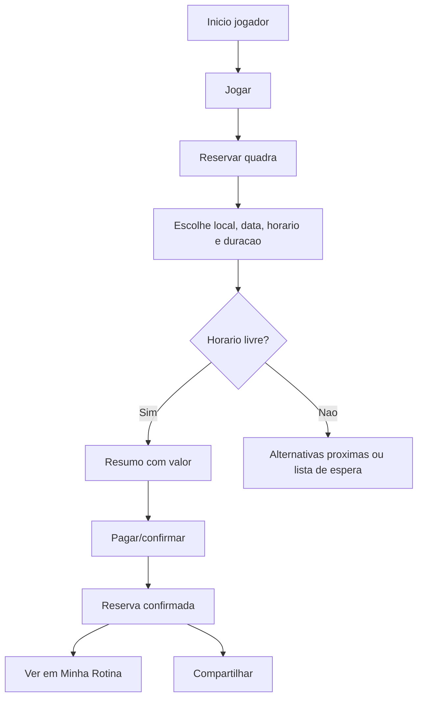

### Nao Deve Ver

- Receita do local;
- Equipe;
- Ajustes;
- Admin de torneio;
- configuracao de unidade;
- ferramentas de staff.

### Aceite

O jogador consegue reservar e encontrar a reserva depois sem passar por Trabalho, Financeiro ou Calendario do local.

## 3. Aluno / Pessoa Com Aulas

### Missao

Entender sua proxima aula, professor, turma, horario, quadra, mensalidade e reposicao.

### Tarefas

| Frequencia | Tarefas |
| --- | --- |
| Diaria/semanal | ver proxima aula |
| Semanal | acompanhar turma e professor |
| Eventual | avisar falta antecipada, pedir reposicao |
| Mensal | pagar mensalidade |

### Primeira Tela Ideal

Player Home ou Minha Rotina mostrando:

- proxima aula;
- professor;
- turma;
- quadra;
- status de pagamento pessoal.

### Fluxo Aula

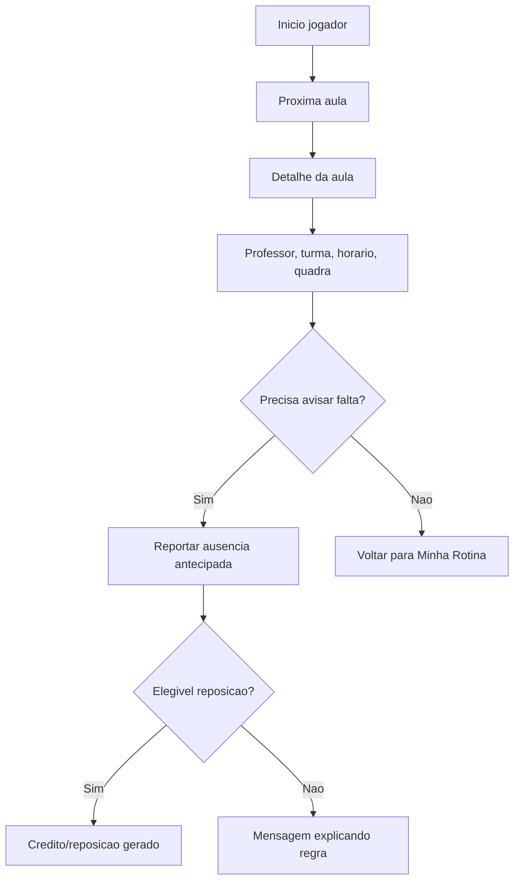

### Nao Deve Ver

- chamada do professor;
- lista completa de alunos;
- financeiro do local;
- configuracao de turma.

### Aceite

Aula nao fica escondida em "Entrar em aula" dentro de Jogar quando o usuario tem matricula ativa.

## 4. Socio / Mensalista De Quadra

### Missao

Usar beneficio do plano para reservar e acompanhar pagamentos pessoais.

### Tarefas

| Frequencia | Tarefas |
| --- | --- |
| Semanal | reservar quadra com regra do plano |
| Mensal | acompanhar mensalidade |
| Eventual | cancelar/alterar reserva |
| Rara | entender regras do plano |

### Fluxo

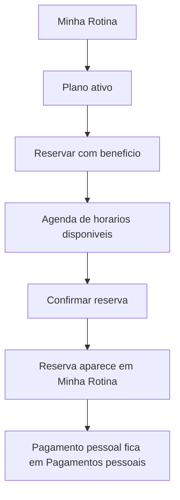

### Nao Deve Ver

- Receita do local;
- relatorio de inadimplentes;
- configuracao de plano.

### Aceite

O usuario entende quando a reserva ficou gratuita/descontada pelo plano e quando existe valor a pagar.

## 5. Jogador Competitivo

### Missao

Acompanhar competicao sem cair em operacao administrativa.

### Tarefas

| Frequencia | Tarefas |
| --- | --- |
| Evento | ver proximo jogo, adversario, horario, local |
| Evento | informar resultado, confirmar disponibilidade |
| Evento | chat/comunicacao |
| Semanal/evento | ver classificacao |

### Fluxo Torneio/Liga Como Jogador

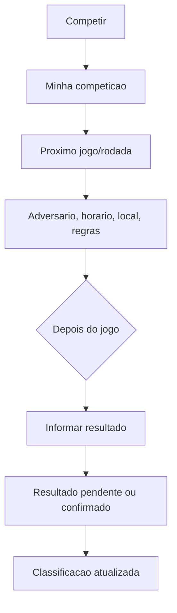

### Nao Deve Ver

- gerar jogos;
- aprovar inscrito;
- configurar liga;
- staff/admin;
- backup/reset.

### Aceite

Participar de competicao nao parece trocar para outro produto sem aviso.

## 6. Professor

### Missao

Saber o que vai ensinar hoje, onde, para quem, e resolver excecoes simples.

### Tarefas

| Frequencia | Tarefas |
| --- | --- |
| Diaria | ver agenda do dia |
| Diaria | abrir aula, ver turma/alunos/quadra |
| Eventual | registrar observacao/evolucao |
| Eventual | consultar aluno |
| Eventual | marcar ausencia/reposicao quando regra permitir |
| Rara | editar perfil |

### Primeira Tela Mobile

- proxima aula;
- lista por hora cheia;
- unidade ativa;
- CTA "Abrir aula".

### Primeira Tela Web

- agenda e turmas do professor;
- alunos vinculados;
- reposicoes pendentes.

### Fluxo Aula Professor

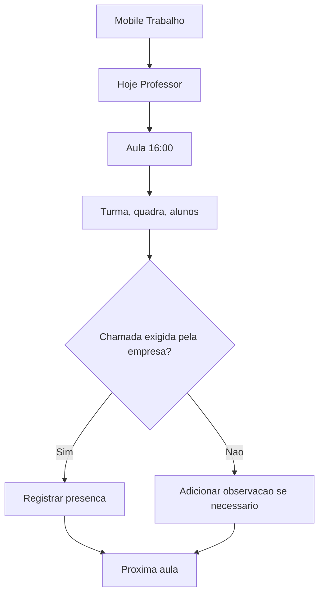

### Nao Deve Ver

- Receita;
- POS;
- equipe;
- ajustes;
- relatorios executivos.

### Aceite

Professor nao cai em ERP. Ele ve aula do dia e alunos antes de qualquer configuracao.

## 7. Recepcao / Secretaria

### Missao

Atender rapido: reserva, pessoa, check-in, reagendamento, lista de espera.

### Tarefas

| Frequencia | Tarefas |
| --- | --- |
| Diaria | criar reserva |
| Diaria | editar/cancelar reserva |
| Diaria | enviar WhatsApp para reagendar/cancelar |
| Diaria | buscar pessoa |
| Eventual | lista de espera |
| Eventual | matricular aluno |
| Rara | nenhuma configuracao estrutural |

### Primeira Tela

- reservas de hoje;
- CTA "Nova reserva";
- busca de pessoa;
- pendencias de espera/reagendamento.

### Fluxo Criar Reserva

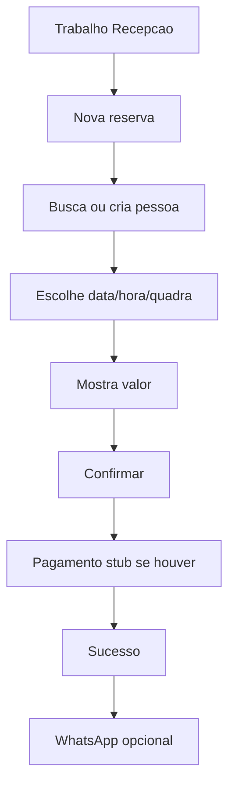

### Fluxo Reagendar

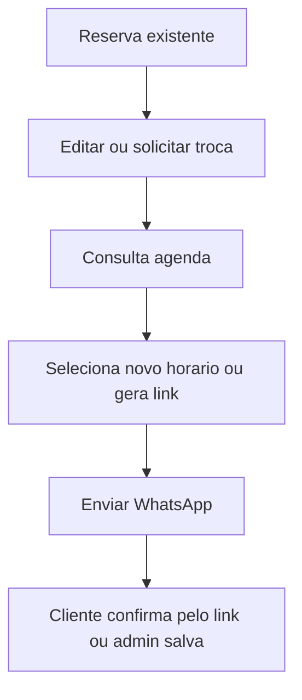

### Nao Deve Ver

- permissoes;
- regras;
- relatorio de receita completo;
- backup/avancado.

### Aceite

Recepcao conclui reserva em no maximo uma tela de fluxo, sem procurar submenus.

## 8. Financeiro

### Missao

Receber, cobrar, marcar pago, ver despesas e resumo sem navegar por aulas/reservas.

### Tarefas

| Frequencia | Tarefas |
| --- | --- |
| Diaria | ver vencidos |
| Diaria | cobrar |
| Diaria | marcar pago |
| Semanal | registrar despesa |
| Semanal | ver pagos |
| Mensal | resumo/relatorio |
| Rara | configurar planos |

### Primeira Tela

- Vencidos;
- Recebiveis de hoje;
- CTA "Cobrar" ou "Marcar pago".

### Fluxo Cobrar

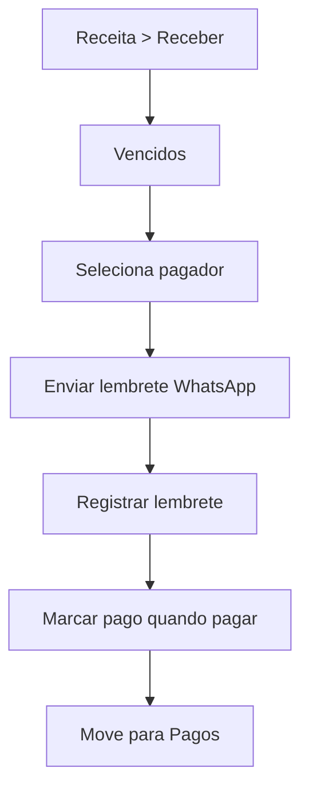

### Nao Deve Ver

- chamada/aulas;
- venda POS;
- perfil pessoal;
- configuracao sem permissao.

### Aceite

Financeiro tem ledger proprio e nao depende de entrar em aluno, reserva ou socio para ver cobrancas.

## 9. Caixa / Cantina

### Missao

Vender em poucos toques e acompanhar estoque baixo.

### Tarefas

| Frequencia | Tarefas |
| --- | --- |
| Diaria | vender item |
| Diaria | ver vendas do dia |
| Diaria | estoque baixo |
| Eventual | cadastrar produto se permitido |

### Primeira Tela

- grade de produtos;
- carrinho;
- CTA Finalizar venda.

### Fluxo

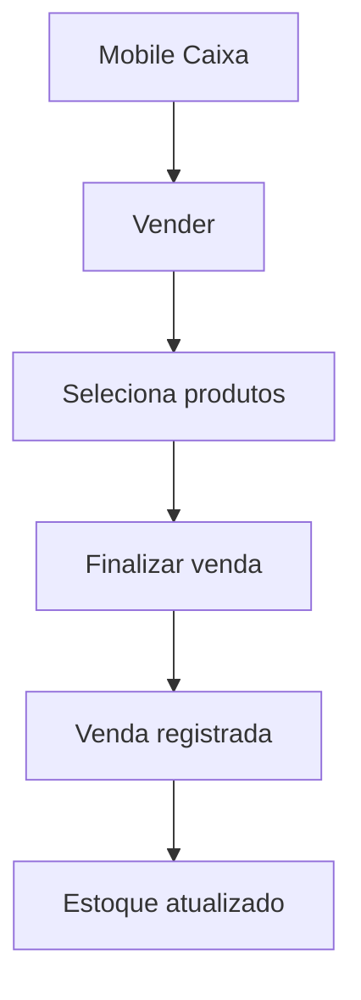

### Nao Deve Ver

- financeiro amplo;
- aulas;
- reservas;
- equipe/admin.

## 10. Gestor De Unidade

### Missao

Resolver bloqueios e administrar a unidade com profundidade no web.

### Tarefas

| Frequencia | Tarefas |
| --- | --- |
| Diaria | ver pendencias criticas |
| Diaria | agenda/ocupacao |
| Semanal | aulas/turmas/alunos |
| Semanal | receita |
| Semanal | pessoas/leads |
| Mensal | relatorios |
| Rara | ajustes/equipe/regras |

### Primeira Tela

- unidade ativa;
- pendencias por dominio;
- maior bloqueio;
- CTA Resolver.

### Fluxo

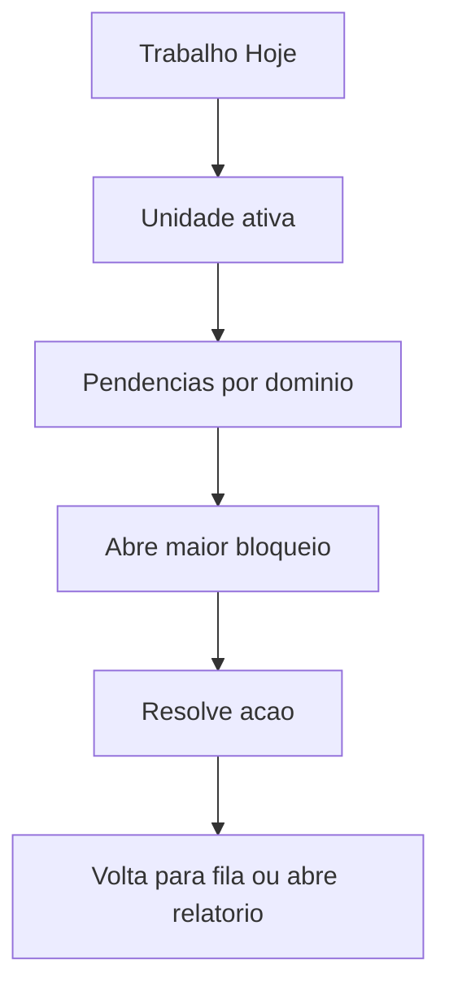

### Aceite

Gestor nao recebe lista infinita de modulos; recebe priorizacao e caminho para profundidade.

## 11. Dono Multiunidade

### Missao

Comparar unidades, abrir unidade critica e manter padrao operacional.

### Tarefas

- trocar unidade;
- ver ranking de urgencia;
- ver receita consolidada;
- ver ocupacao consolidada;
- administrar equipe/permissoes;
- configurar padroes.

### Primeira Tela

- painel organizacional;
- unidades com alertas;
- seletor de unidade;
- CTA abrir unidade critica.

### Risco

Mostrar todas as reservas/aulas de todas as unidades vira ruido. O padrao deve ser consolidado primeiro, detalhe depois.

## 12. Organizador De Torneio/Liga

### Missao

Operar competicoes por fase sem cair em descoberta publica.

### Tarefas

| Fase | Tarefa |
| --- | --- |
| Rascunho | configurar dados, classes, regras |
| Inscricoes | link, inscritos, pagamentos |
| Pre-jogos | gerar jogos, agenda, conflitos |
| Ao vivo | resultados, WO, avisos |
| Final | podio, ranking, relatorio |

### Primeira Tela

- competicoes agrupadas por fase;
- bloqueio mais importante;
- CTA resolver.

### Fluxo

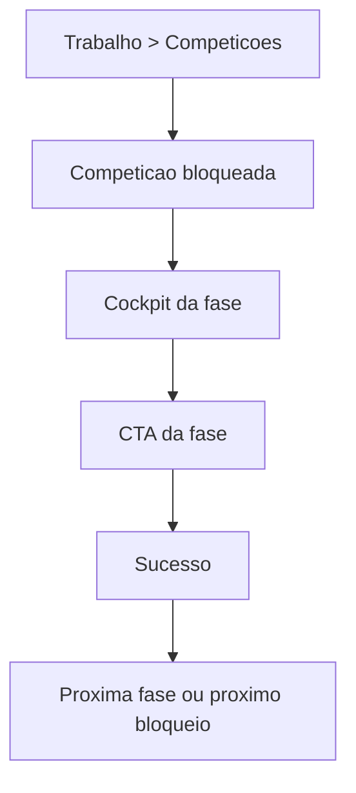

### Nao Deve Ver

- cards de descoberta publica como foco;
- player nav como operacao.

## 13. Scorekeeper

### Missao

Lancar resultado rapido e corretamente.

### Primeira Tela Mobile

- jogos pendentes;
- filtros por quadra/classe/rodada;
- CTA lancar resultado.

### Nao Deve Ver

- configuracao de torneio;
- inscricoes/pagamentos;
- staff.

## 14. Check-in

### Missao

Validar inscritos e presenca no evento.

### Primeira Tela

- inscritos pendentes;
- busca jogador;
- status pagamento/credenciamento;
- CTA confirmar check-in.

### Nao Deve Ver

- sorteio, regras avancadas, reset.

## 15. Media / Comunicacao

### Missao

Publicar avisos, links e resultados.

### Primeira Tela

- comunicacoes pendentes;
- links publicos;
- CTA publicar aviso.

### Nao Deve Ver

- financeiro;
- configuracao estrutural;
- resultados se nao autorizado.

## 16. Usuario Multi-Papel

### Missao

Alternar conscientemente entre vida pessoal e trabalho.

### Regras

- seletor Jogador/Trabalho sempre consistente;
- Player nunca mistura tarefas profissionais;
- Trabalho nunca mistura pagamentos pessoais;
- retorno ao contexto anterior deve ser previsivel;
- unidade/competicao ativa deve estar clara.

### Fluxo

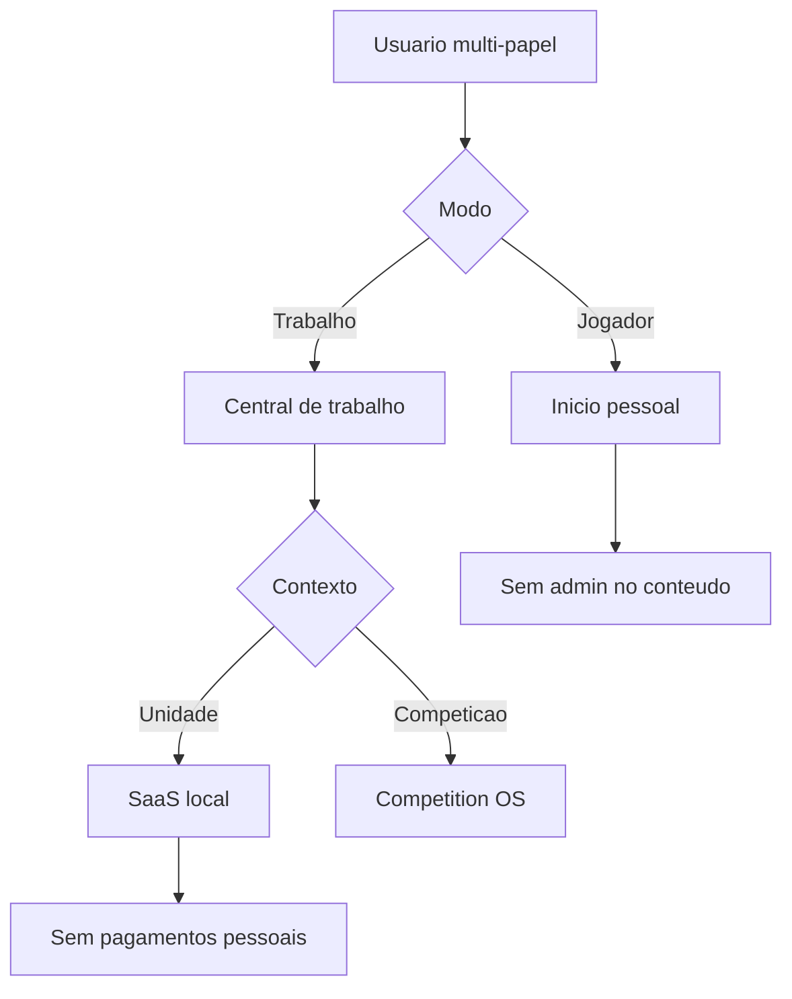

