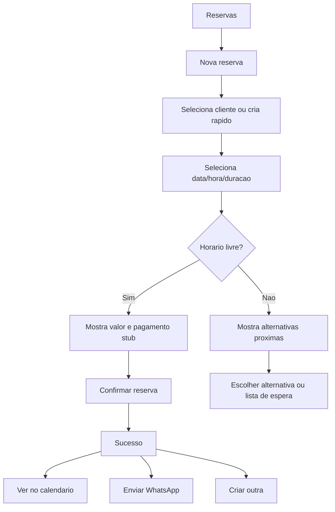
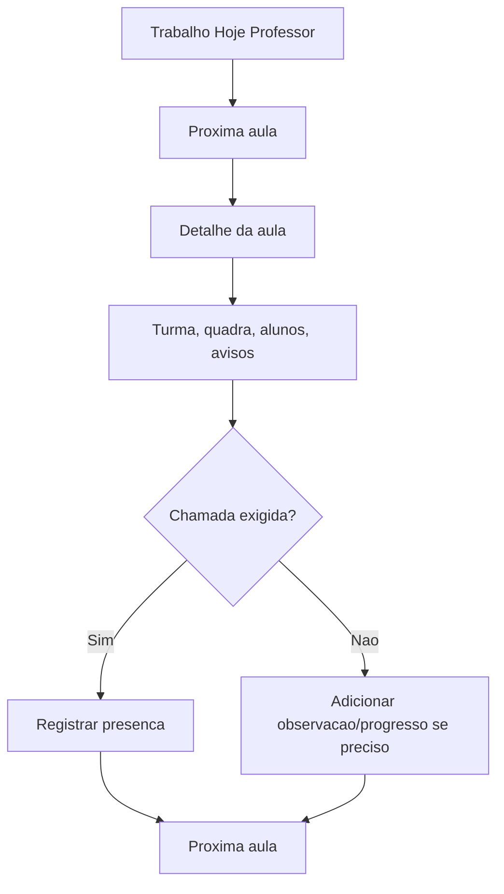
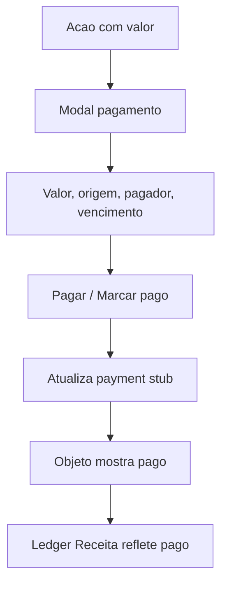
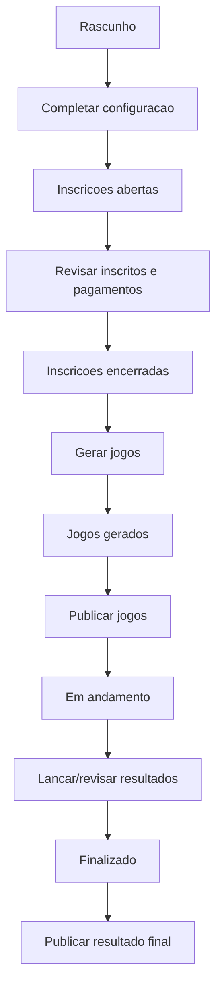
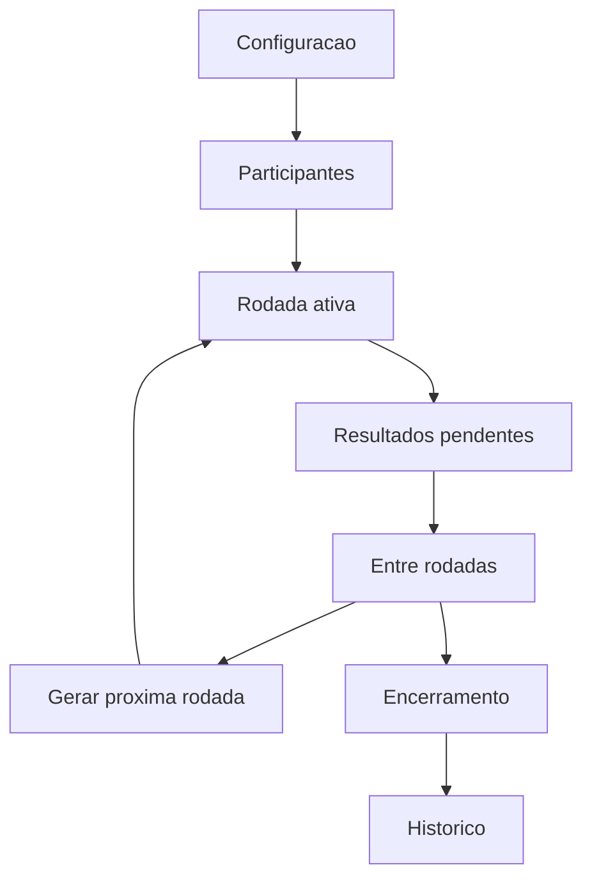

# Work SaaS V5 Screen And Flow Contracts - 2026-05-22

Status: contratos de tela, fluxo e UX para implementacao futura.

Regra: nenhuma tela deve ser implementada sem pergunta principal, CTA primario, estado vazio, permissao e destino de proximo passo.

## 1. Contrato Padrao De Tela

Cada tela deve declarar:

```text
Tela:
Superficie:
Persona primaria:
Personas secundarias:
Pergunta principal:
Primeira dobra:
CTA primario:
CTAs secundarios:
Objeto principal:
O que nao aparece:
Estado vazio:
Estado sem permissao:
Mobile:
Desktop:
Proximo passo apos sucesso:
Rotas preservadas:
```

## 2. Contratos Web Trabalho

### 2.1 Trabalho Hoje

- Superficie: SaaS web + Mobile Trabalho.
- Persona primaria: varia por papel.
- Pergunta: o que precisa ser resolvido agora?
- Primeira dobra: fila por urgencia, unidade ativa, papel ativo, CTA principal.
- CTA primario:
  - professor: abrir proxima aula;
  - recepcao: nova reserva;
  - financeiro: cobrar vencidos;
  - caixa: vender;
  - gestor: resolver maior bloqueio;
  - organizador: abrir competicao bloqueada.
- Nao aparece: setup raro, relatorio completo, lista infinita de modulos.
- Estado vazio: "Sem pendencias agora. Veja a agenda do dia ou abra a proxima area de rotina."
- Mobile: 3 a 5 cards, sem tabela pesada.
- Desktop: command center com work queues por dominio.

### 2.2 Calendario Operacional

- Superficie: SaaS web; mobile por papel.
- Persona primaria: recepcao/gestor; professor em versao filtrada.
- Pergunta: o que ocupa o tempo da unidade hoje?
- Primeira dobra: data, unidade, camadas, grade por hora cheia.
- CTA primario: nova reserva ou abrir proximo item do dia, conforme papel.
- CTAs secundarios: bloquear horario, editar reserva, ver aula, enviar WhatsApp, abrir detalhe.
- Objeto: time slot.
- Nao aparece: regras, precos permanentes, cadastro de quadra.
- Estado vazio: "Nenhum item neste dia. Use Nova reserva ou bloqueie um horario se necessario."
- Mobile: professor ve sua agenda do dia; recepcao ve disponibilidade e reservas.
- Desktop: grade por quadra/professor/camada com horizontal scroll controlado.

### 2.3 Reservas

- Pergunta: quais reservas precisam de acao e como criar/alterar/cancelar?
- Primeira dobra: calendario/lista do dia, CTA Nova reserva, filtros simples.
- CTA primario: Nova reserva.
- CTAs secundarios: editar, cancelar, marcar pago, WhatsApp troca/cancelamento, adicionar espera.
- Nao aparece: Professores/Turmas como filtros primarios; regras e quadras como rotina.
- Estado vazio: "Nenhuma reserva neste periodo. Crie uma reserva ou consulte o calendario."
- Sucesso: "Reserva criada" + Ver no calendario + Enviar WhatsApp + Criar outra.
- Rotas antigas: `/gestao/:placeId/agenda?visao=reservas`, aliases antigos de booking.

Fluxo:



### 2.4 Aulas

- Pergunta: quais aulas, turmas e alunos precisam de acao?
- Primeira dobra:
  - professor: agenda do dia;
  - gestor: turmas ativas, pendencias e vagas.
- CTA primario:
  - professor: abrir proxima aula;
  - gestor/frontdesk: matricular aluno ou resolver pendencia.
- Nao aparece: financeiro amplo, equipe, ajustes.
- Chamada: so aparece se `requireAttendanceCall = true`.
- Estado vazio professor: "Voce nao tem aulas hoje. Veja sua agenda semanal ou turmas."
- Estado vazio gestor: "Nenhuma turma ativa. Crie uma turma ou abra a configuracao de horarios."

Fluxo professor:



### 2.5 Pessoas

- Pergunta: quem e esta pessoa e qual a proxima acao com ela?
- Primeira dobra: busca, filtros por relacao, filas de follow-up.
- CTA primario: criar pessoa/lead ou abrir pessoa pendente.
- CTAs secundarios: WhatsApp, converter lead, matricular, associar plano, cobrar, reservar.
- Nao aparece: lista financeira completa, configuracao de staff.
- Estado vazio: "Nenhuma pessoa nesse filtro. Cadastre um lead/cliente ou remova filtros."
- Desktop: tabela + drawer de pessoa + timeline.
- Mobile: busca rapida + sheet.

### 2.6 Receita

- Pergunta: quem precisa pagar e qual e o estado financeiro do local?
- Primeira dobra: vencidos, hoje, pagos recentes, CTA cobrar/marcar pago.
- CTA primario: cobrar vencidos ou marcar pago.
- CTAs secundarios: criar despesa, ver pagos, criar plano/pacote, resumo.
- Nao aparece: pagamentos pessoais do jogador; POS como fluxo principal.
- Estado vazio: "Nada vencido. Veja recebiveis futuros ou abra pagos/despesas."
- Desktop: tabelas e filtros.
- Mobile financeiro: listas curtas por prioridade.

Fluxo pagamento unico:



### 2.7 Loja/POS

- Pergunta: como vender rapido e acompanhar estoque?
- Primeira dobra: venda rapida.
- CTA primario: finalizar venda.
- CTAs secundarios: vendas do dia, estoque baixo, produtos.
- Nao aparece: financeiro amplo, despesas.
- Estado vazio venda: "Nenhum produto ativo. Cadastre produtos no web."
- Mobile: cashier first.
- Desktop: venda + produtos/estoque.

### 2.8 Competicoes Trabalho

- Pergunta: qual competicao precisa de acao agora?
- Primeira dobra: competicoes agrupadas por fase e bloqueio.
- CTA primario: resolver proximo bloqueio.
- Nao aparece: descoberta publica como foco.
- Estado vazio: "Voce ainda nao organiza competicoes. Crie torneio/liga ou aceite convite."

Torneio:



Liga:



### 2.9 Relatorios

- Pergunta: como esta a operacao/receita/pessoas/competicoes?
- Primeira dobra: periodo, unidade, principais indicadores.
- CTA primario: exportar ou abrir detalhe do relatorio.
- Nao aparece: tarefas operacionais como CTA dominante.
- Estado vazio: "Ainda nao ha dados suficientes para este relatorio."
- Mobile: resumo curto; completo no web.

### 2.10 Administracao

- Pergunta: o que configura a estrutura do negocio?
- Primeira dobra: grupos Configuracao, Equipe, Permissoes, Recursos, Regras, Publicacao, Avancado.
- CTA primario: depende do setup incompleto.
- Nao aparece: operacao diaria.
- Estado vazio: "Configuracao essencial concluida."
- Mobile: apenas alertas bloqueantes e abrir no web.

## 3. Player App Boundary Contracts

### 3.1 Inicio

- Pergunta: qual minha proxima acao pessoal?
- Mostra: proxima reserva/aula/partida/pagamento pessoal.
- Nao mostra: staff, receita do local, admin.

### 3.2 Jogar

- Pergunta: quero reservar, encontrar jogo, aula ou local?
- CTA primario por card: reservar quadra, encontrar jogo, entrar em aula, ver locais.
- Nao mostra: modo organizador, trabalho como card de acao.

### 3.3 Competir

- Pergunta: onde participo ou descubro competicoes?
- Mostra: torneios/ligas/ranking como jogador.
- Nao mostra: operacao de evento, staff admin, botao trabalho dentro do conteudo.

### 3.4 Minha Rotina

- Pergunta: quais compromissos e pendencias pessoais tenho?
- Abas internas permitidas: Tudo, Reservas, Partidas, Aulas, Pagamentos, Historico.
- Menu principal nao precisa duplicar Aulas/Pagamentos se estao dentro da Rotina.

### 3.5 Perfil

- Pergunta: quem sou e como gerencio minha conta pessoal?
- Nao mostra: gestao profissional como se fosse parte do perfil pessoal. Pode haver CTA separado para abrir Trabalho se profissional.

## 4. Estados Obrigatorios Por Dominio

| Dominio | Estado vazio | Sem permissao | Bloqueado por setup |
| --- | --- | --- | --- |
| Hoje | Sem pendencias agora | Mostrar apenas areas permitidas | CTA para owner configurar |
| Calendario | Nenhum item no dia | Ocultar camadas proibidas | Cadastrar quadra/turma |
| Reservas | Sem reservas no periodo | Ocultar editar/cancelar | Cadastrar quadra/regras |
| Aulas | Sem aulas/turmas | professor ve so suas aulas | Cadastrar professor/turma |
| Pessoas | Sem pessoas no filtro | ocultar dados sensiveis | criar lead/cliente |
| Receita | Sem recebiveis | ocultar valores se sem finance | configurar planos/pagamentos |
| POS | Sem produtos | cashier ve apenas venda/estoque | cadastrar produto |
| Competicoes | Sem competicoes | player nao ve admin | completar config |
| Relatorios | Sem dados | ocultar relatorio proibido | aguardar dados |
| Admin | Configuracao completa | ocultar admin | mostrar checklist |

## 5. Regra De Continuidade

Toda tela de sucesso deve oferecer:

- voltar ao objeto;
- ver no calendario/lista;
- comunicar por WhatsApp quando fizer sentido;
- criar outro item;
- abrir proximo bloqueio.

Nunca encerrar fluxo em silencio.

